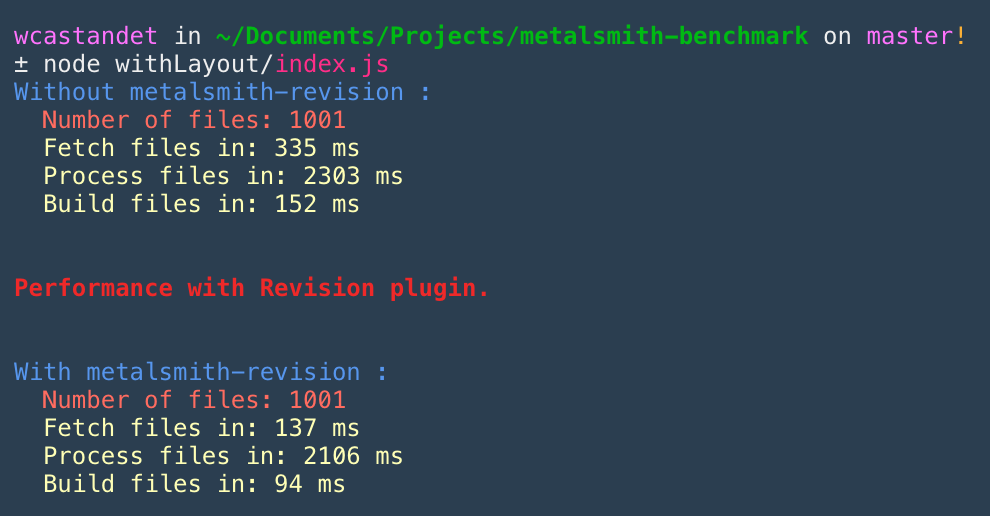
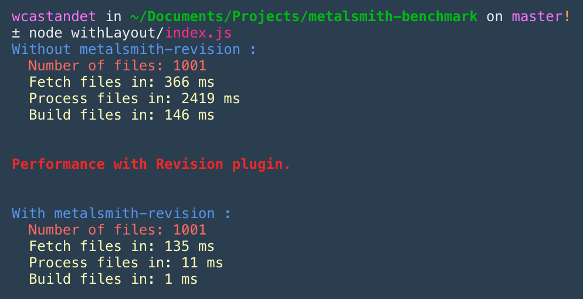

# Metalsmith-benchmark for metalsmith-revision

Small performance test for metalsmith-revision package

---

The first will have the same perf with ou without the plugin.

then if you change one file in my source file, metalsmith will only rebuild this file :

## Don't forget to add .clean(false) to your metalsmith build script :)
